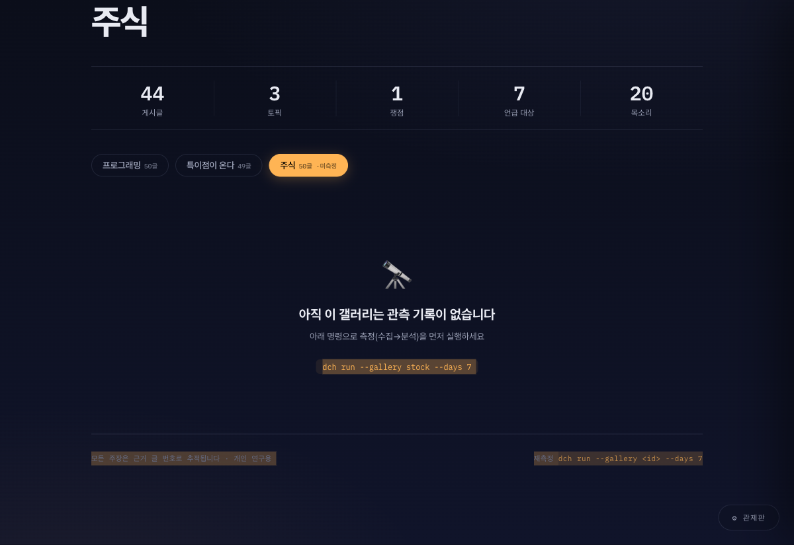
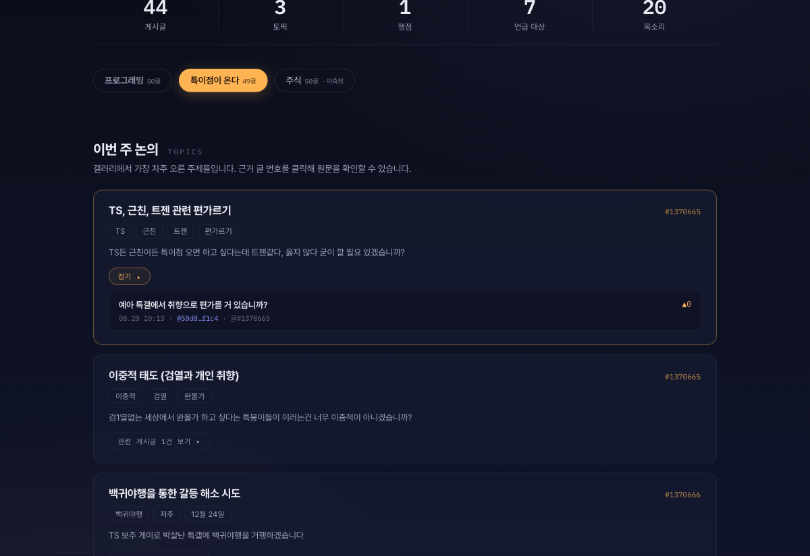
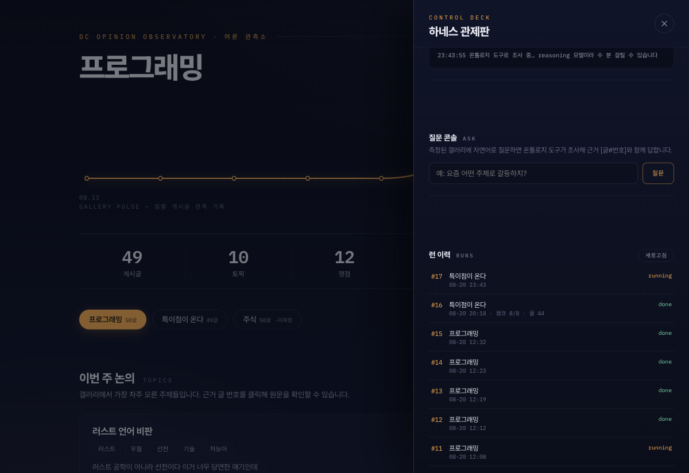

# dc-harness

**DC Inside 갤러리 여론 관측 하네스** — 커뮤니티 글을 수집해 LLM으로 토픽·여론·니즈를 분석하고, 온톨로지 계층 위에서 질문에 답하는 연구용 도구.

갤러리 하나를 "관측 대상"으로 삼아 → 글을 수집하고 → LLM map-reduce로 분석하고 → 모든 주장에 **근거 글 번호**를 붙여 리포트·웹 뷰어로 보여줍니다. "AI가 지어냈는지 진짜 글인지"를 클릭 한 번으로 검증할 수 있는 것이 핵심 설계입니다.

## 기능

### 1. 수집 — DC Inside 스크래퍼
- 메인/마이너(`--minor`) 갤러리 지원, 페이지 단위 수집
- **예의 딜레이**(기본 1.5초+지터), 차단·캡차 감지 시 안전 중단, 삭제된 글은 건너뛰기
- 아카이브 갤러리(폐쇄, 예: 주식갤 200702~201109) 자동 감지·경고
- 댓글은 AJAX로 로드되는데 쿠키가 없으면 우아하게 게시글만 수집
- JSONL 파일 적재(`ingest`)로 수집 없이 분석만 돌릴 수도 있음

### 2. 분석 — LLM map-reduce 4종
| 종류 | 뽑아내는 것 |
|---|---|
| topics | 상위 논의 주제 + 키워드 + 근거 글 |
| sentiment | 쟁점별 찬/반/중립 발언과 인용, 추천수 기반 공감 반응 |
| entities | 인물·제품·브랜드별 언급 수와 감성 |
| voices | VOC — 불만 · 바람(~있으면 좋겠다) · 아이디어 |

- 글이 길면 청크로 나눠 map-reduce, 청크당 재시도, **모든 LLM 호출은 `llm_calls` 테이블에 감사 기록**(프롬프트·버전·성공/실패)
- 프롬프트를 바꾸면 `PROMPT_VERSION` 상향으로 전 계층 lineage 보존

### 3. 온톨로지 — 의미 계층 (Palantir Foundry 방식에서 영감)
- 선언적 정의 `ontology.toml` — 객체 8종·링크 6종 상한, 검증기 V1–V6
- 원본(posts/comments)은 **불변**. 분석 결과는 파생 객체(`obj_*`)로 **run 단위 스냅샷**
- 모든 파생 행은 `run_id`·`prompt_version`·**근거 글 번호** 필수 — 결과 역추적 가능
- `ask`는 읽기 전용 도구 3종(queryObjects/getThread/stats)만 쓰는 OMCP 스타일 에이전트 — **[글#번호] 인용 없으면 답변 거부**

### 4. 웹 뷰어 · 관제판 — `krw-ontology-dc web`
로컬 전용(127.0.0.1) 초경량 서버. 의존성 추가 없이 Python 표준 라이브러리만.

**여론 관측소 (메인 화면)**
- 일별 활동량 맥박 파형, 카운트업 지표, 갤러리 칩 전환
- **관련 게시글 버튼** — 토픽·목소리 카드의 근거 글이 제목·글쓴이(익명 식별자)·일시와 함께 펼쳐짐
- 모든 `[글#N]` 인용 클릭 → **원문 모달**(본문·메타·DC 원문 링크)
- **질문 콘솔** — 자연어로 물으면 온톨로지 도구가 근거 인용과 함께 답변, 인용 클릭으로 원문 검증
- **측정 리포트** — 마크다운 렌더(표·리스트)된 전체 리포트

**관제판 (컨트롤 덱)**
- 측정 실행: 갤러리 ID·기간·페이지·마이너 여부 → 수집→분석→리포트 원클릭
- 실시간 진행상황: 단계(수집/분석/리포트)·경과시간·이벤트 로그 스트리밍, 완료 시 뷰어 자동 갱신
- 런 이력(커버리지) · LLM 감사 로그

## 빠른 시작

    python3 -m venv .venv && .venv/bin/pip install -e ".[dev]"

    export MOTIF_API_KEY=...        # LLM API 키 (필수, 소스에 금지)
    export DC_COOKIES="name1=v1; name2=v2"   # 선택: DC 차단 시 브라우저 쿠키

    krw-ontology-dc run --gallery programming --days 7 --pages 3   # 수집→분석→리포트
    krw-ontology-dc web                                          # → http://127.0.0.1:8765

기본 LLM은 한국어 reasoning 모델([chat.motiftech.io](https://chat.motiftech.io) openapi, `motif-12.7b-reasoning`)이지만 base_url/model은 설정 가능. OpenAI 호환 엔드포인트면 뭐든 됩니다.

## CLI 레퍼런스

| 명령 | 설명 |
|---|---|
| `collect` | DC Inside 수집 (`--gallery`, `--pages`, `--minor`) |
| `ingest` | JSONL 파일 적재 (수집 대체) |
| `analyze` | LLM 분석만 실행 (`--kinds` 선택) |
| `report` | 저장된 분석으로 리포트 재생성 |
| `run` | 수집→분석→리포트 전체 |
| `query` | 온톨로지 객체 질의 (결정적, LLM 없음) |
| `show` | 게시글 상세 + 연결된 토픽 |
| `ask` | 자연어 질의 (읽기 전용 도구, 인용 강제) |
| `ontology` | 온톨로지 정의 인쇄 (`--json`) |
| `web` | 로컬 웹 뷰어·관제판 가동 |

    # 예시
    krw-ontology-dc query --object Topic --gallery programming
    krw-ontology-dc ask --gallery programming "요즘 뭐로 갈등하지?"

## 아키텍처

    DC Inside ──collect──▶ posts/comments   (원본 · 불변)
                                │  chunk → map-reduce (llm_calls 감사)
                                ▼
                            analyses        (run 단위 결과)
                                │  materialize — lineage 부여
                                ▼
                            obj_* 온톨로지 객체 ──▶ ask(읽기 전용 도구)
                                │
                                ▼
                        report(md+json) · 웹 뷰어 · 관제판

- 저장소: SQLite 단일 파일 (`data/dch.db`) — 외부 DB 불필요
- 웹: stdlib `http.server`, 127.0.0.1 전용 바인딩
- 프로젝트 구조: `dc_harness/collect` · `analyze` · `ontology` · `llm` · `report` · `web`

## DC Inside 실측 노트 (2026-08)

- **아카이브 갤러리**: 폐쇄된 갤러리(예: `stock` 주식갤=200702~201109, `baseball_new`)는 오류 없이 200으로 **과거 글만** 반환. 페이지 제목이 `YYYYMM~YYYYMM 갤러리명`이면 아카이브 — 수집 시 알림이 뜬다. 살아있는 갤러리는 쿠키 없이도 최근 글이 수집된다.
- **댓글**: 정적 HTML에 없고 `POST /board/comment/` AJAX로 로드. JS 생성 쿠키를 요구해 없으면 거부되며, 이때는 게시글만 수집(우아한 저하). 필요하면 브라우저에서 gall.dcinside.com의 `document.cookie`를 `DC_COOKIES`로 제공.

### fixture 리프레시 (스크래퍼 드리프트 대응)

실제 페이지 구조가 바뀌어 파서가 깨지면:

    bash scripts/refresh_fixtures.sh crypto

로 live HTML을 `tests/fixtures/dc/`에 저장하고, 파서를 fixture에 맞춰 수정한 뒤 커밋한다.

## 연구 윤리

공개 데이터만, 예의적 rate-limit(기본 1.5초+지터), **작성자는 해시 기반 익명 식별자로만 저장**(원 닉네임 미보관 — 동일 작성자 구분용), 리포트에 개인정보 미포함, 연구 목적 외 사용 금지.

## 더 읽기

- [CONVENTIONS.md](CONVENTIONS.md) — 네임리·변경 절차·디버깅 순서
- `docs/superpowers/` — 설계 문서와 단계별 계획(원본)
